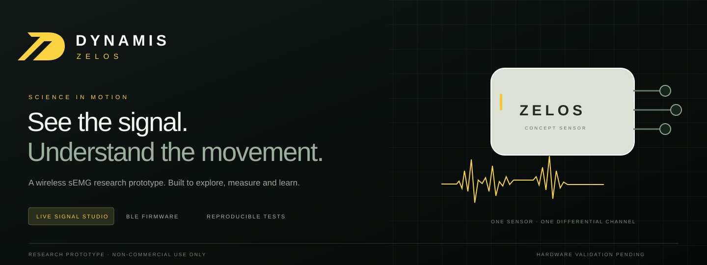
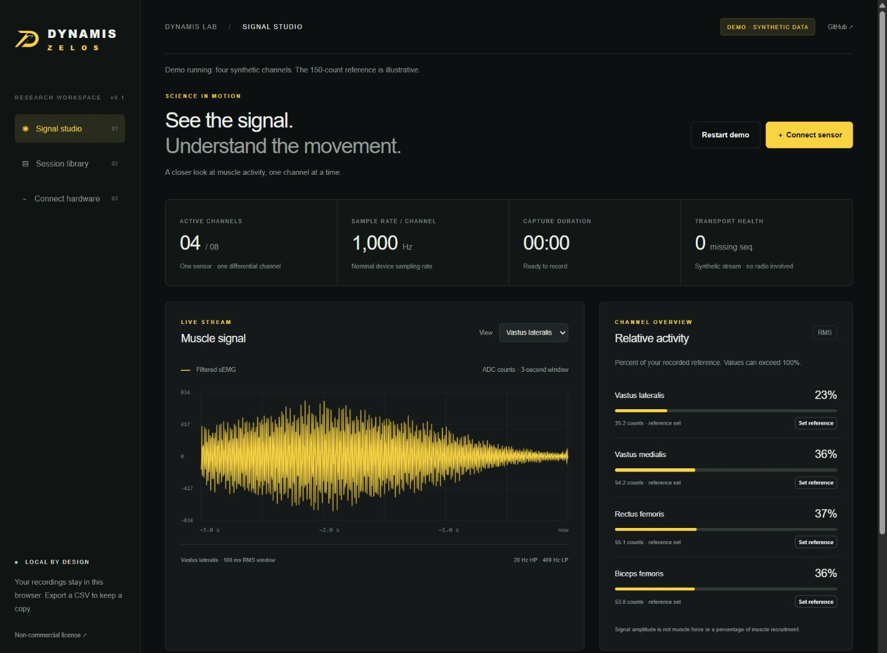
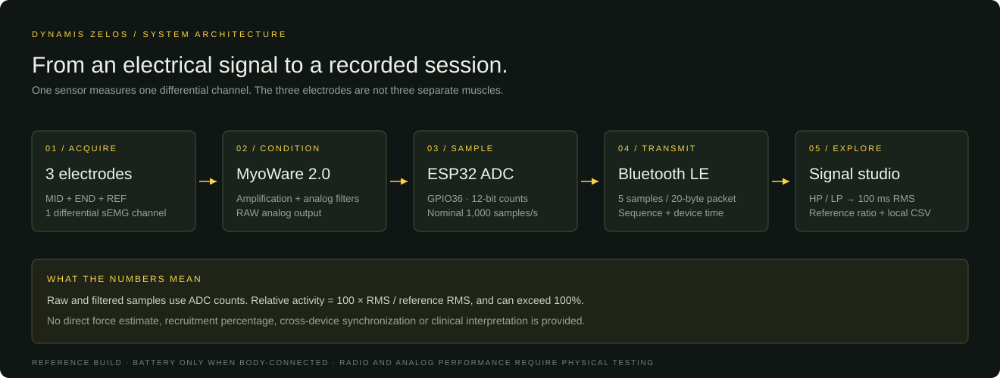
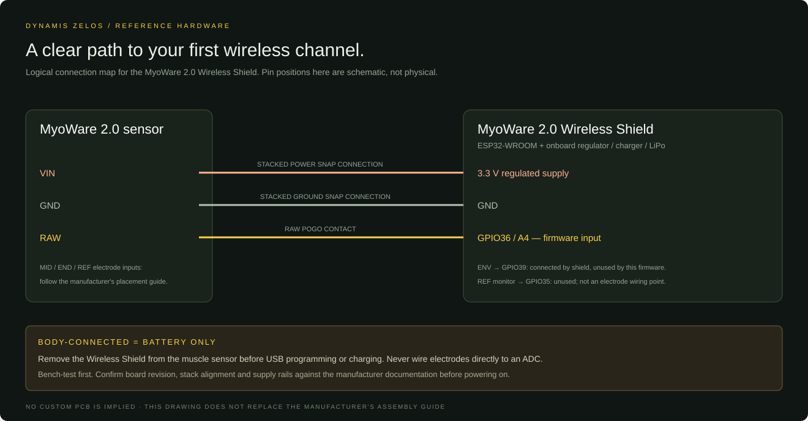

# DYNAMIS ZELOS

**A local signal studio for exploring surface electromyography.**

Explore a four-channel simulation, connect a reference BLE sensor, inspect
filtered signals and RMS, record a session, and compare saved recordings.
This repository includes the browser application, reference ESP32 firmware,
automated tests, hardware instructions, and English technical illustrations.

**Status:** experimental prototype · **Use:** non-commercial only ·
**Data:** stored in your browser · **Runtime:** Node.js 22 or newer

[Get started](docs/QUICKSTART.md) · [Choose hardware](docs/HARDWARE.md) ·
[Firmware](firmware/README.md) · [Validation](docs/VALIDATION.md) ·
[License](LICENSE)



*Actual application screenshot using synthetic data. It does not show a
measurement from a person or validate a physical sensor.*

## Run the software

Install [Node.js](https://nodejs.org/en/download) version 22 or newer, then:

```sh
git clone https://github.com/Aguirato/dynamis-zelos.git
cd dynamis-zelos
npm start
```

Open **[http://localhost:4173](http://localhost:4173)**. The demo starts with
four deterministic simulated channels. No hardware, account, package
installation, or cloud service is required. The application has no npm
dependencies. If you do not use Git, download and extract the repository ZIP
and run `npm start` from the extracted project folder.

Use **Start recording**, then **Stop & save** and **Export CSV**. Open **Session library**
to revisit saved recordings. Follow the [step-by-step guide](docs/QUICKSTART.md)
for reference capture, comparisons, browser requirements, and troubleshooting.

## What is implemented

| Capability | Current implementation |
| --- | --- |
| Simulation | Four deterministic synthetic channels; restartable demo |
| Live transport | Browser Web Bluetooth receiver and one-channel ESP32 reference firmware |
| Signal processing | 20 Hz high-pass and 400 Hz low-pass first-order digital filters; rolling 100 ms RMS |
| Relative activity | Three-second reference capture per channel; RMS expressed as a percentage of that reference |
| Signal quality | Packet-gap accounting, invalid-packet rejection, and ADC rail detection |
| Recording | Raw ADC samples, filtered signal, RMS, reference values, channel identity, and device/host timing |
| Export and history | CSV export, local IndexedDB history, mean/peak RMS and clipping summaries |
| Expansion | App limit of eight BLE devices; simultaneous physical performance remains unverified |

Amplitudes are **ADC counts**. A reference percentage can exceed 100% and is
not a measure of force, muscle recruitment, fatigue, or clinical condition.
There is no calibrated microvolt conversion in this release. Saved-session
comparisons require consistent hardware, gain, placement, and procedure.

## From electrodes to software



One sensor produces **one differential sEMG channel** using the selected
sensor's measurement and reference electrode arrangement. Three electrodes
do not produce three independently measured muscles.

The reference build uses a **MyoWare 2.0 Muscle Sensor and MyoWare 2.0 Wireless
Shield with ESP32**. Its RAW output is sampled through the shield's GPIO 36
route. The firmware targets 1,000 samples per second and sends five 12-bit ADC
samples in each 20-byte notification. This is a documented prototype route,
not a qualified finished wearable.

1. Review the [hardware options and bill of materials](docs/HARDWARE.md).
2. Read the [body-contact and power precautions](docs/SAFETY.md). Remove the
   wireless shield from the sensor before USB programming or charging.
3. Follow the [firmware build and upload instructions](firmware/README.md),
   then complete the no-person bench checks.
4. Run the local app in a supported browser, click **Connect sensor**, and
   select your `ZELOS` device in the browser chooser.
5. Verify incoming data and transport health before capturing a reference or
   recording. Expand beyond one device only through measured validation.



See [QUICKSTART](docs/QUICKSTART.md) for the complete connection workflow and
[PROTOCOL](docs/PROTOCOL.md) for packet fields, identifiers, and timing limits.

## Concept and implementation

The original project images define the DYNAMIS ZELOS identity and product
direction. They are concept illustrations. This release makes the software
and a reference prototype path concrete without treating the illustrations
as a manufactured design or a performance report.

| In the original concept | In this repository |
| --- | --- |
| DYNAMIS platform and ZELOS wearable identity | English interface, documentation, and recreated technical visuals |
| One sensor per muscle region | One differential channel per reference sensor; the signal is not guaranteed to isolate a single muscle |
| nRF52840 wireless microcontroller | ESP32 reference firmware; nRF52840 port remains future work |
| AD8293 analog front end and a 24-bit ADC | MyoWare 2.0 RAW signal with the ESP32's 12-bit ADC; no AD8293 circuit or 24-bit acquisition driver is provided |
| Optional LSM6DS3 motion sensing | No IMU acquisition or movement-fusion feature in this release |
| Custom compact PCB, enclosure, USB-C charging, and strap | No production PCB, enclosure CAD, or validated custom charging design is supplied |
| Up to eight simultaneous sensors | Software connection limit of eight; radio reliability and cross-device synchronization remain unqualified |
| Up to eight hours of battery life | No measured endurance claim; the chosen assembly must be measured |
| Illustrated 3.7 V, 400 mAh cell | Reference Wireless Shield has its own built-in 40 mAh cell; a different cell requires a reviewed power design |
| Laptop and phone product mockups | Responsive browser UI; a native mobile app and iOS live BLE support are not provided |
| Muscle-performance percentages | RMS relative to a user-captured reference; no force or clinical interpretation |

The [roadmap](docs/ROADMAP.md) lists the evidence required to move these
future features forward.

## Tests and validation

```sh
npm test
npm run check
```

The Node test suite covers packet encoding/decoding, malformed data, packet
loss and counter rollover, signal processing, reference behavior, simulation,
CSV handling, session summaries, and local server boundaries. The firmware
also includes a host-side packet test and a pinned board build procedure.

See [VALIDATION](docs/VALIDATION.md) for recorded results, manual checks, and
the distinction between software verification and physical qualification.
An automated build does not establish electrode safety, analog accuracy,
wireless reliability, battery life, or medical suitability.

## Documentation

| Guide | Contents |
| --- | --- |
| [Quickstart](docs/QUICKSTART.md) | Install, run, simulate, connect, reference, record, export, and troubleshoot |
| [Hardware](docs/HARDWARE.md) | Candidate hardware, reference build, signal routes, and component selection |
| [Safety](docs/SAFETY.md) | Battery-only body-contact precautions and bench-to-body boundaries |
| [Firmware](firmware/README.md) | Pinned toolchain, target board, compile, upload, and bench checks |
| [Protocol](docs/PROTOCOL.md) | BLE UUIDs, packet layout, sample units, counters, and timing |
| [Validation](docs/VALIDATION.md) | Software checks, physical test plan, and evidence limits |
| [Roadmap](docs/ROADMAP.md) | Development stages and acceptance criteria |
| [Licensing](docs/LICENSING.md) | Allowed non-commercial use and prohibited commercial activities |
| [Contributing](CONTRIBUTING.md) / [Security](SECURITY.md) | Contributions, attribution, data handling, and vulnerability reports |

## License

Copyright © 2026 Lucas Aguiar ([Aguirato](https://github.com/Aguirato)).

Released under the custom [DYNAMIS ZELOS Non-Commercial License 1.0](LICENSE).
Non-commercial use, modification, and redistribution are permitted under its
conditions. **Commercial use and commercial redistribution are prohibited**
without separate written permission. Third-party components retain their own
terms. This is a source-available project, not an OSI-approved open-source
release. See [licensing details](docs/LICENSING.md).
