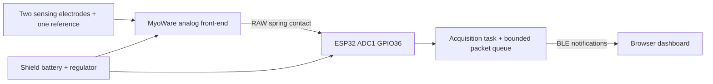

# Hardware selection, assembly, and connection

The reference implementation targets **one SparkFun MyoWare 2.0 Muscle Sensor plus one MyoWare 2.0 Wireless Shield (ESP32-WROOM)**. It provides a concrete starting point for the DYNAMIS ZELOS concept without pretending the pictured custom PCB already exists. Firmware build checks are separate from physical validation; no real sensor, electrode assembly, RF throughput, battery runtime, or enclosure has been validated by this repository's automated tests.

Start with the software simulator, then validate a single device on a bench. Read [SAFETY.md](SAFETY.md) and [VALIDATION.md](VALIDATION.md) before assembling body-connected hardware.

## Select a path

| Path | Purpose | Repository support |
| --- | --- | --- |
| Browser simulator | Explore recording and analysis without buying hardware | Included |
| MyoWare 2.0 + Wireless Shield | One-channel reference prototype using off-the-shelf sensor and battery/BLE board | Included ESP32 firmware; physical validation required |
| MyoWare 2.0 + separate original ESP32 development board | Bench development using the same ADC pin and BLE protocol | Firmware can be adapted; wiring and power require review before body use |
| nRF52840 + suitable biopotential front-end | Future smaller or lower-power custom design | Architecture candidate only; no firmware, PCB, or validated wiring supplied |
| Proprietary BLE sEMG device | Use an existing commercial instrument | Requires documented vendor protocol and an adapter; not automatically compatible |

## Reference bill of materials

| Quantity | Component | Selection note |
| --- | --- | --- |
| 1 | MyoWare 2.0 Muscle Sensor | Confirm the actual revision and its official guide; this is the analog front-end |
| 1 | SparkFun MyoWare 2.0 Wireless Shield, DEV-23387 | Original ESP32-WROOM; not an arbitrary ESP32-C3/S3 board |
| 3 per placement | Compatible disposable snap surface electrodes | Follow electrode labeling; use fresh electrodes as directed |
| 1 | USB-C **data** cable | Used only with the Wireless Shield detached from the sensor |
| 1 | Computer with BLE adapter and Web Bluetooth capable browser | Begin with current Chrome or Edge desktop and localhost; verify OS/browser support on the actual computer |
| 1 | Nonconductive enclosure/strap and strain relief | Must keep conductive parts protected; no enclosure design is certified here |
| Optional | MyoWare 2.0 Cable Shield and manufacturer-compatible electrode cable | For moving the sensor off the electrode site; follow the exact shield guide rather than guessing cable colors |

The Wireless Shield supplies the radio, charger, and a built-in 40 mAh single-cell LiPo; a separate 400 mAh battery is not part of this reference BOM. See the [manufacturer product page](https://www.sparkfun.com/myoware-2-0-wireless-shield.html). No price, stock, or runtime is guaranteed here. Existing stock labeled MyoWare 2.0 and newer sensor revisions should not be assumed identical without checking their documentation.

## How the reference boards connect

The two boards stack through their intended snap connectors and spring contacts. With power off, align the labeled connections; do not force or reverse the assembly. The reference firmware uses the following manufacturer-documented mapping, with GPIO numbers rather than Arduino analog aliases:

| Sensor signal | Wireless Shield route | Firmware |
| --- | --- | --- |
| VIN | Regulated 3.3 V supply through matching snap | Supply, not an electrode |
| GND | Matching ground snap | Power return, not an electrode |
| RAW | Spring contact near VIN → GPIO36 / ADC1 | **Selected input** |
| ENV | Matching snap → GPIO39 / ADC1 | Available on board but not streamed by this firmware |
| REF test point | Spring contact near GND → GPIO35 | Not sampled by this firmware; do not confuse with a power ground connection |

Pin mapping and power switch behavior are documented in the [SparkFun Wireless Shield hardware guide](https://learn.sparkfun.com/tutorials/getting-started-with-the-myoware-20-muscle-sensor-ecosystem/myoware-20-wireless-shield).

The three skin electrodes form **one differential measurement channel**: two sensing contacts and one reference contact. They are not three separate muscle channels. Use the sensor's electrode connections and the manufacturer's placement guide. For the optional cable shield, identify contacts using its supplied documentation rather than a generic red/black convention. Check [MyoWare's advanced guide](https://cdn.sparkfun.com/assets/learn_tutorials/1/9/5/6/MyoWare_v2_AdvancedGuide-Updated.pdf) for the exact sensor revision and placement guidance.



## Install and flash the firmware

**Remove the Wireless Shield from the sensor before attaching USB.** For programming, set `POWER SOURCE` to `VBAT` and `POWER` to `ON`, as described by SparkFun. Connect its USB-C data cable to the computer. Install a CH340 driver only if the operating system does not recognize the board, using the [manufacturer's driver guide](https://learn.sparkfun.com/tutorials/how-to-install-ch340-drivers/all).

Use Arduino CLI 1.2.2 and the pinned Espressif Arduino core 3.0.7. The older pinned core makes this reference reproducible; it is not a claim to use the latest core. Review and test dependency upgrades before adopting them.

Run these commands from the repository root after installing [Arduino CLI](https://docs.arduino.cc/arduino-cli/installation/):

```sh
arduino-cli core update-index --additional-urls https://espressif.github.io/arduino-esp32/package_esp32_index.json
arduino-cli core install esp32:esp32@3.0.7 --additional-urls https://espressif.github.io/arduino-esp32/package_esp32_index.json
arduino-cli compile --warnings all --fqbn esp32:esp32:esp32:PartitionScheme=huge_app firmware/zelos_esp32
arduino-cli board list
```

Use the port returned by `board list`, for example `COM5` on Windows:

```sh
arduino-cli upload --port COM5 --fqbn esp32:esp32:esp32:PartitionScheme=huge_app firmware/zelos_esp32
arduino-cli monitor --port COM5 --config baudrate=115200
```

Arduino IDE users can open `firmware/zelos_esp32/zelos_esp32.ino`, install **esp32 by Espressif Systems, version 3.0.7**, select **ESP32 Dev Module**, select **Huge APP (3 MB No OTA/1 MB SPIFFS)** partition scheme and the detected port, then compile/upload. GPIO numbers are fixed in the sketch, so a separate SparkFun board package is not required. The supplied build uses the BLE library bundled with the core; do not add an unrelated ArduinoBLE or NimBLE library.

The first serial message gives a name such as `ZELOS-12AB`. Every five seconds the firmware reports cumulative acquisition, missed timer events, spacing error, queue/stale packet drops, and notification results. Read serial diagnostics only in the detached bench setup. If upload fails, first verify the data cable, port, drivers, and power switches; use the shield manufacturer's bootloader procedure if needed.

## Bench check, then connect the software

1. With no sensor or person connected, flash and power the detached shield. A floating ADC is not a meaningful EMG test signal.
2. Open the dashboard using the repository's local server. Use its BLE connect action, choose the `ZELOS-…` peripheral, and allow the browser connection. The app subscribes to the service and characteristic in [PROTOCOL.md](PROTOCOL.md); operating-system audio pairing is not required.
3. In a detached bench-only setup, use a suitable signal source or simulator and measurement equipment to test the ADC path within its allowed range. Do not attach electrodes or a person to that setup. Follow the explicit checks in [VALIDATION.md](VALIDATION.md), including packet loss, timing, clipping, and reconnect behavior.
4. After successful bench validation and review of suitability for body use, switch off, remove all cables, and stack the battery-powered shield on the sensor. Check spring contact alignment. Follow the manufacturer's electrode placement and attachment directions. Select `VBAT`, switch on, then connect through the browser.
5. Record a relaxed baseline and a comfortable reference contraction using the app's calibration controls. Keep gain and placement unchanged for the comparison. The normalized display reflects that reference; it is not an absolute measure of muscle strength.
6. Stop the session and export the recording. Switch the shield off and remove it from the sensor before reconnecting USB for charging or debugging.

One channel is the initial validation target. For additional muscles, use a separate complete sensor node per measurement site and connect each node independently. Multi-node throughput and clock alignment require separate validation; the concept's eight-node illustration is not proof that eight nodes work on a particular host.

## ADC and signal limits

The ESP32 returns uncalibrated 12-bit counts. At the configured 11 dB attenuation, Espressif documents an approximate measurable range of 150–3100 mV for the original ESP32, so a 3.3 V sensor output can clip before the supply rail. Check the actual ADC and front-end behavior rather than multiplying counts by `3.3/4095` and labeling the result as microvolts. See the [Espressif ADC documentation](https://docs.espressif.com/projects/arduino-esp32/en/latest/api/adc.html).

MyoWare RAW is already amplified and filtered and includes a DC offset. The manufacturer's first-order analog low-pass around 498 Hz does not provide a sharp anti-alias barrier at a 1 kHz sampling rate. This is an educational waveform/activation prototype; defensible spectral or fatigue measurements need a reviewed analog filter, sampling plan, ADC characterization, and signal processing pipeline. The envelope gain control does not provide a general calibrated RAW gain adjustment. See [MyoWare's technical specifications](https://myoware.com/products/technical-specifications/) and advanced guide.

## Alternative development paths

For a **detached bench-only MyoWare + separate ESP32-WROOM** experiment, the conceptual connections are sensor `VIN` to regulated `3V3`, sensor `GND` to controller ground, and sensor `RAW` to GPIO36. Do not supply the sensor with 5 V while sending its output directly into the ESP32. This is not a reviewed wearable wiring recipe; battery protection, fault paths, exposed conductors, and body isolation still need review before human contact. Never move the electrodes directly onto ADC pins.

The original images proposed **nRF52840**, **AD8293**, a **24-bit ADC**, and a custom enclosure. Those are not the implemented reference hardware. Nordic's [nRF52840 specification](https://docs.nordicsemi.com/r/bundle/ps_nrf52840/page/keyfeatures_html5.html) describes its 12-bit ADC; a 24-bit signal chain needs an external converter. The [AD8293G80/G160](https://www.analog.com/en/products/ad8293g160.html) is an instrumentation amplifier, not a complete 24-bit digital EMG front-end. A device such as TI's [ADS1292R](https://www.ti.com/product/ADS1292R) includes two 24-bit converters and biopotential front-end functions, but choosing it still requires a complete reviewed analog design, appropriate bandwidth, input protection, power architecture, SPI firmware, and a protocol update. No bare-chip electrode wiring is supplied here.

An optional IMU, custom PCB, compact enclosure, rechargeable 400 mAh battery, and synchronized multi-node operation remain engineering work. Neither the illustrated eight-hour runtime nor resistance to water/sweat has been measured.

## Troubleshooting

| Symptom | Check |
| --- | --- |
| No `ZELOS` device in chooser | Correct firmware; battery charged; power switches; host BLE enabled; HTTPS or localhost; supported browser; device not connected elsewhere |
| Device connects but no samples | Notify subscription; RAW spring contact; inspect detached serial diagnostics; confirm UUID and packet version |
| Flat signal near zero/full scale | Power and signal alignment, ADC clipping, damaged connection; do not adjust gain until the signal path is understood |
| Signal looks noisy with movement | Electrode contact, cable movement, strap pressure, crosstalk; return to controlled stationary validation |
| Frequent gaps | Radio interference, host adapter/OS throughput, sampling timing breaks, another BLE application, too many nodes |
| Sensor works but dashboard rejects packets | Vendor protocol mismatch; v1 requires exactly 20 bytes, five RAW 12-bit readings, and 1 kHz metadata |

Manufacturer sources were checked on 2026-10-08. Check the exact board revision and current manufacturer instructions before purchase or assembly.
